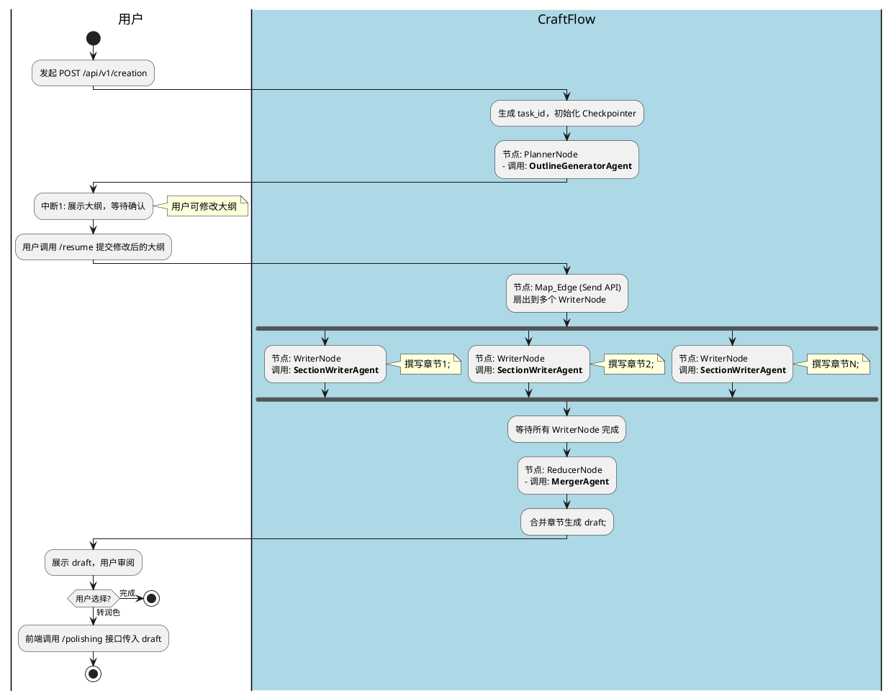
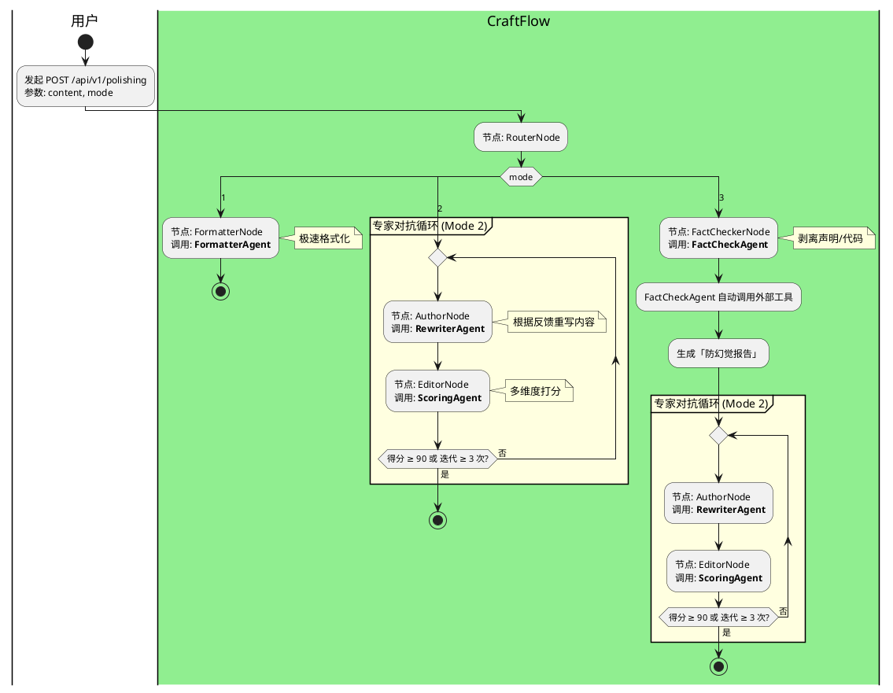

# CraftFlow 接口流程图解

## /api/v1/creation

```plantuml
@startuml
|用户|
start
:发起 POST /api/v1/creation;
|#LightBlue|CraftFlow|
:生成 task_id，初始化 Checkpointer;
:节点: PlannerNode
- 调用: **OutlineGeneratorAgent**;
|用户|
:中断1: 展示大纲，等待确认;
note right: 用户可修改大纲
:用户调用 /resume 提交修改后的大纲;
|#LightBlue|CraftFlow|
:节点: Map_Edge (Send API)
扇出到多个 WriterNode;
fork
   :节点: WriterNode
   调用: **SectionWriterAgent**;
   note right: 撰写章节1;
 fork again
   :节点: WriterNode
   调用: **SectionWriterAgent**;
   note right: 撰写章节2;
 fork again
   :节点: WriterNode
   调用: **SectionWriterAgent**;
   note right: 撰写章节N;
 end fork
:等待所有 WriterNode 完成;
:节点: ReducerNode
- 调用: **MergerAgent**;
- 合并章节生成 draft;
|用户|
:展示 draft，用户审阅;
if (用户选择?) then (完成)
   stop
else (转润色)
   :前端调用 /polishing 接口传入 draft;
   stop
endif
@enduml
```

## /api/v1/polishing

```plantuml
@startuml
|用户|
start
:发起 POST /api/v1/polishing
参数: content, mode;
|#LightGreen|CraftFlow|
:节点: RouterNode;
switch (mode)
case (1)
   :节点: FormatterNode
   调用: **FormatterAgent**;
   note right: 极速格式化
   stop
case (2)
   partition "专家对抗循环 (Mode 2)" #LightYellow {
      repeat
         :节点: AuthorNode
         调用: **RewriterAgent**;
         note right : 根据反馈重写内容
         :节点: EditorNode
         调用: **ScoringAgent**;
         note right : 多维度打分
      repeat while (得分 ≥ 90 或 迭代 ≥ 3 次?) is(否) not(是)
   }
   stop
case (3)
   :节点: FactCheckerNode
   调用: **FactCheckAgent**;
   note right: 剥离声明/代码
   :FactCheckAgent 自动调用外部工具;
   :生成「防幻觉报告」;
   -> 
   partition "专家对抗循环 (Mode 2)" #LightYellow {
      repeat
         :节点: AuthorNode
         调用: **RewriterAgent**;
         :节点: EditorNode
         调用: **ScoringAgent**;
      repeat while (得分 ≥ 90 或 迭代 ≥ 3 次?) is(否) not(是)
   }
   stop
endswitch
@enduml
```
